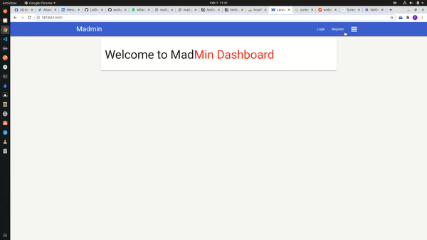

## Madmin Dashboard (Laravel & Blade Template)

## About Project

A Laravel project building an Admin Dashboard, using **Controllers, Middleware, Requests, Providers, Blade Template...**

> Project Sample

#### Technologies

_PHP_

_LARAVEL DOC_ - [Laravel](https://laravel.com/docs/8.x/readme)

_Materialize-CSS_ - [Materialize-CSS](https://materializecss.com/)

> Project By Collins Abadaike collinspro18@gmail.com
